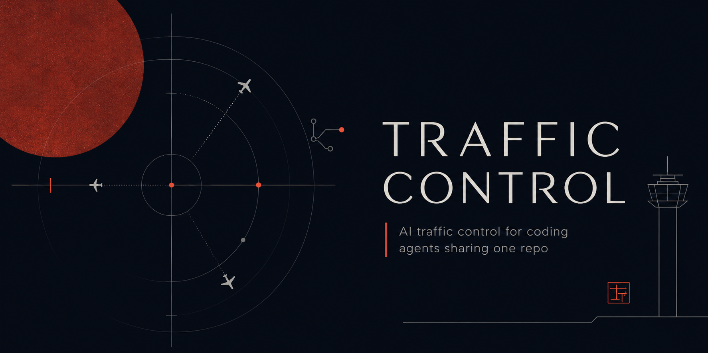

<p align="center">
  
</p>

# Traffic Control

[](https://github.com/andrefigueira/traffic-control/actions/workflows/ci.yml)
[](https://github.com/andrefigueira/traffic-control/releases)
[](go.mod)

**Run a swarm of AI coding agents in one repo without them overwriting each other.**

Point several Claude Code agents at the same working tree and they go blind to each other. Two of them open the same file, both edit it, and the second save wins. The first agent's work is gone, and nothing told anyone. Air traffic control solved this exact shape of problem for aircraft sharing one sky: a tower tracks who is where and grants clearance to act. Traffic Control does that for coding agents. A tiny background daemon, the tower, tracks who is flying, what each agent is touching, and a shared board of what everyone is doing, then warns or blocks the moment two agents reach for the same file.

It is one Go binary with zero dependencies. Install it, and Claude Code agents coordinate automatically through hooks and an MCP server. There is nothing to wire into your code.

## Why this exists

The honest competition is git worktrees, and they are great when you want isolation: each agent gets its own checkout, so they physically cannot touch the same files, and you merge afterwards. Use worktrees for that.

Traffic Control is for the case worktrees make painful: several agents in **one shared tree** with **one live environment**. One dev server. One database. Hot reload intact. No N checkouts to provision, seed, and reconcile. In that setup the agents are otherwise flying blind, and that is where work gets silently clobbered.

This is not a niche corner. Claude Code now ships [agent teams](https://code.claude.com/docs/en/agent-teams), where multiple sessions share one tree, a task list, and a mailbox. Its own documentation tells you how it handles file conflicts:

> Two teammates editing the same file leads to overwrites. Break the work so each teammate owns a different set of files.

That is the whole mitigation, and it is left to you. Traffic Control is the layer that makes the overwrite visible and, when you want it, stops it.

## 60-second setup

You need Go to build.

```sh
git clone https://github.com/andrefigueira/traffic-control
cd traffic-control
./install.sh
```

That builds the `tc` binary and drops it in `~/.local/bin`. Then, in any project you want coordinated:

```sh
cd my/project
tc install-claude   # wire this project's Claude Code hooks + MCP server
```

Now run Claude Code in that project as usual. The first agent to start auto-starts the tower, so there is no separate daemon to babysit. That is the whole setup.

`tc install-claude` merges four hooks into `.claude/settings.json` and the MCP server into `.mcp.json` without touching the rest of your config. Run `tc install-claude --print` to see exactly what it adds before it writes anything.

## See it catch a collision

Drive the tower by hand to watch it work. This is also how you test it without Claude.

```
$ tc clearance "internal/**" --mode exclusive --callsign alpha
CLEARED: cleared

$ tc check internal/api/server.go
internal/api/server.go is held by alpha (exclusive)

$ tc clearance internal/api/server.go --callsign bravo
error: DENIED: alpha is holding internal/** (exclusive). Hold for handoff or coordinate on the board.
```

Alpha claimed a whole subtree with a recursive glob, and Bravo was turned away from a file three levels down inside it. In a Claude session this happens automatically: the `PreToolUse` hook requests clearance on every Edit, Write, and MultiEdit, so the block lands before the write, not after the damage.

## How the Claude integration works

`tc` is the daemon, the CLI, the hook handler, and the MCP server, all in one binary.

**Hooks** run automatically, with no agent effort:

- `SessionStart` checks the agent in and injects the current board into its context, so a fresh agent immediately knows who else is working and on what.
- `PreToolUse` on Edit, Write, MultiEdit, and NotebookEdit requests clearance for the target file. Under an exclusive hold by another agent, the edit is blocked and the agent is told who holds it. Otherwise it proceeds, with an advisory note when someone else is nearby or has filed a flight plan over that path.
- `PostToolUse` sends a heartbeat that refreshes the agent's holds, so an agent working a long turn never has a file swept out from under it. On a Bash command it also diffs the working tree against a pre-command snapshot and claims advisory holds for whatever changed, so an edit made through `sed -i`, a formatter, or a codemod is still seen.
- `Stop` hands the agent's clearances back when its turn ends, so holds never outlive active work.

**MCP tools** are deliberate, called by the agent when it chooses: `file_flight_plan`, `request_clearance`, `handoff`, `whos_flying`, `read_board`, `check_path`.

Enforcement is **advisory by default**: it warns the agent and the human and lets the edit through. Set `TC_ENFORCE=1` to make `PreToolUse` request an exclusive hold and hard-block any held path. Under that policy an agent cannot opt itself down to a weaker hold through MCP either.

## Flight plans that outlast a turn

A clearance lives for one turn. The moment an agent stops, it hands everything back, which keeps the board self-cleaning and means a held file is never stale.

A flight plan is the longer-lived signal. When an agent files one with the paths it is about to work on, that plan stays on the board after the turn ends, and any other agent that later reaches for one of those paths is warned. Flight plans from agents who have left stop warning, so the board does not fill with ghosts. This is the awareness that survives between turns, and it is useful even if you never turn on the lock.

## The scope (live dashboard)

The tower serves a zero-dependency dashboard, the scope, at its root.

```sh
tc scope     # prints the URL and opens it in your browser
```

Or open `http://127.0.0.1:7700/` directly. It shows, live over the event stream: who is in the air, what clearances are held, the board, and a running frequency of events with conflict alerts and advisory overlaps called out. Flip on desktop alerts and it pings you when two agents collide. This is the awareness layer made visible, the part that helps even when the lock is off.

## CLI

| Command | Does |
| --- | --- |
| `tc serve` | Run the tower (agents auto-start it, so you rarely need this) |
| `tc status` | Tower health, who is flying, and any dropped-event warnings |
| `tc flightplan "msg" --paths a,b` | Announce what you are about to do |
| `tc clearance PATH --mode exclusive` | Request to hold a path |
| `tc handoff [PATH]` | Release a path, or all of yours |
| `tc check PATH` | Is this path already held |
| `tc whos-flying` | List checked-in agents |
| `tc board` | Read the broadcast board |
| `tc watch` | Stream the live frequency (reconnects on its own) |
| `tc stop` | Stop an auto-started tower |

## What it catches, and what it does not

Traffic Control catches **file-level** collisions: two agents reaching for the same file, the same directory, or paths that overlap through a glob, including recursive `**` subtree claims. It catches them up front, at the edit, rather than at merge time.

It does not catch **semantic** coupling. One agent changing a function signature while another edits a caller in a different file will pass clearance and still break the build. The board and the scope are what help there, by keeping agents aware of each other's plans. Closing this gap with a lightweight symbol index is the next thing on the roadmap.

Two more honest edges:

- **Bash edits are caught after the fact, not up front.** Clearance is requested before an Edit, Write, MultiEdit, or NotebookEdit. A file rewritten through `sed -i`, a formatter, or a codemod run via Bash cannot be coordinated before it happens, but the Bash hooks now diff the working tree and claim advisory holds for whatever changed, so the next agent to reach for those files is warned. This needs a git work tree and is awareness rather than prevention. If the tower is unreachable for any reason, every hook fails open and says so on stderr, so a silent loss of coordination is at least a loud one.
- **State is in memory.** A tower restart drops presence and holds. The agents recover on their next turn, but durable storage across restarts is on the roadmap.

## The vocabulary

| Aviation | In Traffic Control |
| --- | --- |
| **The tower** | The daemon. Everything checks in with it. |
| **Flight plan** | An agent announcing what it is about to work on. |
| **Clearance** | A held path. Advisory by default, exclusive on request. |
| **Holding pattern** | A blocked agent waiting on a path another holds. |
| **Handoff** | Releasing a held path. |
| **Conflict alert** | The warning when two agents reach for the same path. |
| **The frequency** | The pub/sub event stream (`tc watch`, or `GET /events`). |
| **The board** | The running broadcast of flight plans and done updates. |
| **Callsign** | An agent's identity. |

## Architecture

- **The tower** (`internal/tower`): in-memory state of sessions, clearances, and the board, plus a non-blocking pub/sub broker that counts any event it has to drop so a slow listener is visible, not silent. Transport agnostic.
- **HTTP API** (`internal/api`): localhost JSON over `127.0.0.1:7700` with a Server-Sent Events stream. No auth, no TLS. It is a single-user local coordinator.
- **The `tc` binary** (`cmd/tc`): the CLI, the hook handler, and the MCP stdio server, all talking to the tower through one client, so the surfaces cannot drift apart.

## Status

The MVP is built, tested, and hardened: presence, the board, advisory and exclusive clearance with directory and recursive-glob matching, flight plans that warn across turns, the pub/sub frequency, the full CLI, the four Claude hooks, and the MCP server. The core is covered by unit tests, the HTTP and MCP layers by integration tests, and the tower runs clean under the race detector.

Plan in [ROADMAP.md](./ROADMAP.md), history in [CHANGELOG.md](./CHANGELOG.md), the deeper design and research notes in [RESEARCH-AND-GAPS.md](./RESEARCH-AND-GAPS.md), backlog in [GitHub Issues](https://github.com/andrefigueira/traffic-control/issues).

## Contributing

Contributions are welcome. The project is one Go binary with zero runtime dependencies, so getting set up is quick.

```sh
git clone https://github.com/andrefigueira/traffic-control
cd traffic-control
make check   # gofmt, go vet, and the full race-enabled test suite
```

`make check` is the same bar CI enforces. Anything you push should pass it: `gofmt` clean, `go vet` clean, and `go test -race ./...` green. New behaviour wants a test, both the happy path and the failure path, since this is a coordination tool people trust to not lose their work.

A few ways in:

- **Found a bug or a sharp edge?** Open an [issue](https://github.com/andrefigueira/traffic-control/issues) with the steps to reproduce. The two known gaps (Bash edits bypassing hooks, in-memory state) are documented above, so anything beyond those is worth reporting.
- **Picking up work?** The [roadmap](./ROADMAP.md) and [issues](https://github.com/andrefigueira/traffic-control/issues) list what is planned. The symbol index for semantic coupling and durable storage across restarts are the two big ones.
- **Sending a PR?** Keep changes focused, match the surrounding style, and explain the why in the description. The architecture notes above and [RESEARCH-AND-GAPS.md](./RESEARCH-AND-GAPS.md) cover how the pieces fit together.

The design leans on one rule worth keeping in mind: a hook must never break the agent. If the tower is down or anything goes sideways, the hook fails open and says so on stderr. Coordination is an enhancement, so it can degrade, and it can never become a gate that wedges a session.

## Prior art

- **git worktrees** (`isolation: worktree` in Claude Code): isolation by separate checkouts, no awareness between agents. The right tool when you want isolation.
- **Claude Code agent teams**: shared task list, mailbox, and presence for multiple sessions in one tree, with file conflicts left to the user to avoid by hand.
- **`agent-comms` and similar**: agents announce files and negotiate before starting, usually poll-based, no daemon, no live presence, no enforcement.

Traffic Control's bet is that a persistent tower with live presence, a broadcast board, flight plans that survive a turn, and first-class Claude hook plus MCP integration with real enforcement is worth the small footprint for agents sharing one tree.
